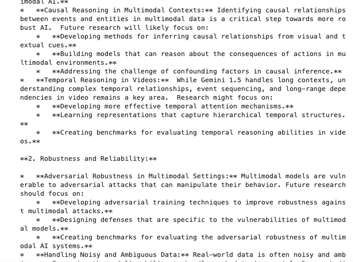

# GCP-LAB-Intro-to-Context-Caching-with-the-Gemini-API
Intro to Context Caching with the Gemini API

#### Overview
The Gemini API provides the context caching feature for developers to store frequently used input tokens in a dedicated cache and reference them for subsequent requests, eliminating the need to repeatedly pass the same set of tokens to a model. This feature can help reduce the number of tokens sent to the model, thereby lowering the cost of requests that contain repeat content with high input token counts. In this lab, you will learn how to use the Gemini API context caching feature in Vertex AI.

##### Gemini
Gemini is a family of powerful generative AI models developed by Google DeepMind, capable of understanding and generating various forms of content, including text, code, images, audio, and video.

##### Gemini API in Vertex AI
The Gemini API in Vertex AI provides a unified interface for interacting with Gemini models. This allows developers to easily integrate these powerful AI capabilities into their applications. For the most up-to-date details and specific features of the latest versions, please refer to the official Gemini documentation.

##### Gemini Models
- Gemini Pro: Designed for complex reasoning, including:
. Analyzing and summarizing large amounts of information.
. Sophisticated cross-modal reasoning (across text, code, images, etc.).
. Effective problem-solving with complex codebases.

- Gemini Flash: Optimized for speed and efficiency, offering:
. Sub-second response times and high throughput.
. High quality at a lower cost for a wide range of tasks.
. Enhanced multimodal capabilities, including improved spatial understanding, new output modalities (text, audio, images), and native tool use (Google Search, code execution, and third-party functions).


##### Prerequisites

Before starting this lab, you should be familiar with:

. Basic Python programming.
. General API concepts.
. Running Python code in a Jupyter notebook on Vertex AI Workbench.


##### Objectives

In this lab, you will learn how to:

. Create a context cache.
. Retrieve and use a context cache.
. Use context caching in chat.
. Update the expire time of a context cache.
. Delete a context cache.

### Task 1. Open the notebook in Vertex AI Workbench
In the Google Cloud console, on the Navigation menu (Navigation menu icon), click Vertex AI > Workbench.

Find the vertex-ai-jupyterlab instance and click on the Open JupyterLab button.

The JupyterLab interface for your Workbench instance opens in a new browser tab.


### Task 2. Set up the notebook
Open the intro_context_caching file.

In the Select Kernel dialog, choose Python 3 from the list of available kernels.

Run through the Getting Started and the Import libraries sections of the notebook.

For Project ID, use qwiklabs-gcp-04-1bb79721fd73, and for Location, use europe-west4.


#### Get started
Install Google Gen AI SDK for Python

`%pip install --upgrade --quiet google-genai`

##### Set Google Cloud project information and create client
To get started using Vertex AI, you must have an existing Google Cloud project and enable the Vertex AI API.

Learn more about setting up a project and a development environment.

```
import os

PROJECT_ID = "qwiklabs-gcp-04-1bb79721fd73"  # @param {type: "string", placeholder: "[your-project-id]", isTemplate: true}
LOCATION = "europe-west4"  # @param {type:"string"}

if not PROJECT_ID or PROJECT_ID == "qwiklabs-gcp-04-1bb79721fd73":
    PROJECT_ID = str(os.environ.get("GOOGLE_CLOUD_PROJECT"))

from google import genai

client = genai.Client(vertexai=True, project=PROJECT_ID, location=LOCATION)
```

##### Code Examples

Import libraries

```
from IPython.display import Markdown, display
from google.genai.types import (
    Content,
    CreateCachedContentConfig,
    GenerateContentConfig,
    Part,
)
```


Task 3. Create a context cache
Run the Create a context cache section of the notebook.

##### Create a context cache
Note: Context caching is only available for stable models with fixed versions (for example, gemini-2.0-flash-001). You must include the version postfix (for example, the -001).

For more information, see Available Gemini stable model versions.

`MODEL_ID = "gemini-2.0-flash-001"  # @param {type:"string"}`

Context caching is particularly well suited to scenarios where a substantial initial context is referenced repeatedly by shorter requests.

- Cached content can be any of the MIME types supported by Gemini multimodal models. For example, you can cache a large amount of text, audio, or video.

>Note: The minimum size of a context cache is 32,769 tokens.

- The default expiration time of a context cache is 60 minutes. You can specify a different expiration time using the ttl (time to live) or the expire_time property.
This example shows how to create a context cache using two large research papers stored in a Cloud Storage bucket, and set the ttl to 60 minutes.

. Paper 1: Gemini: A Family of Highly Capable Multimodal Models
. Paper 2: Gemini 1.5: Unlocking multimodal understanding across millions of tokens of context

```
system_instruction = """
You are an expert researcher who has years of experience in conducting systematic literature surveys and meta-analyses of different topics.
You pride yourself on incredible accuracy and attention to detail. You always stick to the facts in the sources provided, and never make up new facts.
Now look at the research paper below, and answer the following questions in 1-2 sentences.
"""

cached_content = client.caches.create(
    model=MODEL_ID,
    config=CreateCachedContentConfig(
        contents=[
            Content(
                role="user",
                parts=[
                    Part.from_uri(
                        file_uri="gs://cloud-samples-data/generative-ai/pdf/2312.11805v3.pdf",
                        mime_type="application/pdf",
                    ),
                    Part.from_uri(
                        file_uri="gs://cloud-samples-data/generative-ai/pdf/2403.05530.pdf",
                        mime_type="application/pdf",
                    ),
                ],
            )
        ],
        system_instruction=system_instruction,
        ttl="3600s",
    ),
)
```

You can access the properties of the cached content as example below. You can use its name or resource_name to reference the contents of the context cache.

>Note: The name of the context cache is also referred to as cache ID.

```
print(cached_content.name)
print(cached_content.model)
print(cached_content.create_time)
print(cached_content.expire_time)
print(cached_content.usage_metadata)
```


### Task 4. Retrieve and use a context cache
Run the Retrieve and use a context cache section of the notebook.

#### Retrieve a context cache
You can use the property name to reference the contents of the context cache. For example:

`new_cached_content = client.caches.get(name=cached_content.name)`

#### Use a context cache

To use the context cache, you provide the cached_content resource name in the config parameter of the generate_content() method.

Then you can query the model with a prompt, and the cached content will be used as a prefix to the prompt.

```
response = client.models.generate_content(
    model=MODEL_ID,
    contents="What is the research goal shared by these research papers?",
    config=GenerateContentConfig(
        cached_content=cached_content.name,
    ),
)

display(Markdown(response.text))
```


### Task 5. Use context caching in Chat
Run the Use context caching in Chat section of the notebook.


##### Use context caching in Chat
You can use the context cache in a multi-turn chat session.


`chat = client.chats.create(model=MODEL_ID)`


```
prompt = """
How do the approaches to responsible AI development and mitigation strategies in Gemini 1.5 evolve from those in Gemini 1.0?
"""

response = chat.send_message(prompt)

display(Markdown(response.text))
```


```
prompt = """
Given the advancements presented in Gemini 1.5, what are the key future research directions identified in both papers
for further improving multimodal AI models?
"""

response = chat.send_message(prompt)

print(response.text)
```





### Task 6. Update the expire time of a context cache
Run the Update the expire time of a context cache section of the notebook.

#### Update the expiration time of a context cache
The default expiration time of a context cache is 60 minutes. To update the expiration time, update one of the following properties:

ttl - The number of seconds that the cache lives after it's created or after the ttl is updated before it expires.

expire_time - A Timestamp that specifies the absolute date and time when the context cache expires.


```
cached_content = client.caches.update(
    name=cached_content.name,
    config=CreateCachedContentConfig(
        system_instruction=system_instruction,
        ttl="7200s",
    ),
)

print(cached_content.expire_time)
```

>2025-05-08 07:14:22.920704+00:00

#### Delete a context cache
You can remove content from the cache using the delete operation.

`client.caches.delete(name=cached_content.name)`

>DeleteCachedContentResponse()


